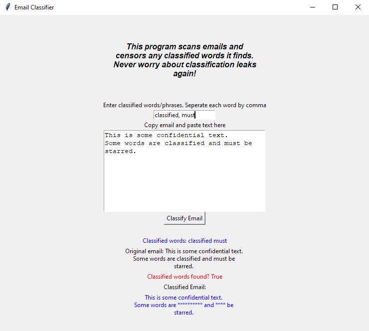

# Email Classifier Project



## Introduction

I created a tkinter GUI interface in Python that allows users to enter a comma-seperated list of "classified" words and paste/type a body of email text and search the text for any of the classified words. If any of the classified words are found, the words are replaced with asterisks, and a boolean flag is returned, signaling True if any of the words are found, or false if none are found. If no words are found, the original email is left the same. The classifier maintains the original email structure and content, including any tabs, return characters, punctuation, and white space. NOTE: Tkinter graphically displays slightly differently depending on host OS. Depending on your OS, the app may look different than what is shown in the above picture.

## Directory Structure

```
├── email_classifier_app
│   ├── email_classifier.py                 <---- main application, creates GUI interface using Python Tkinter for email classifier
│   ├── email_classifier_function.py        <---- contains email_classifier and censor function used to take an email and censor words with astericks
│   ├── test_email_classifier.py            <---- contains tests for email classifier functions
│   ├── README.md                           <---- this file
│   ├── requirements.txt                    <---- contains required packages
│   └── assets
│       └── email_classifier.png            <---- picture for README
```

## Technology

- Written in Python, uses tkinter, regex, unittest modules

## Issues

I ran into a multitude of issues while creating this application. The largest was finding a regular expression (regex) that would correctly maintain the original email structure and still allow the classifier to work properly. Regex101.com was a fantastic source that helped me solve the problem.

## Limitations

This email classifier does not search for substrings inside strings. However, the function could be changed to use a list instead of a dictionary and use two for loops to slowly crawl through the text using the "sliding window" technique. A window of X length equal to the classified word length would move character by character through the email, searching for a window in the email that matched. However, this would eliminate the optimization created by using a dictionary for lookup average time complexity of O(1).

## Edge Cases/ Considerations

Creating an email classifier contains many edge cases, not limited to white space characters, newline characters, tab delimiters, and punctuation.

## Function

First, the email_classifier function checks if the inputs are of correct type (list, str). An empty list is created to append the classified email that is about to be created. A regex takes the email input and seperates it by punctuation, any white space (space, tab, return), and whole words, and creates a new list. A dictionary is then created from the classified words list input. The function loops through each word in the new list created by the regex, and if that word is in the classified word dictionary, the return boolean is changed to true to signify a word was found. The word is then "censored" and replaced with asterisks and appended to the new censored email list. If the word is not a classified word, it is regularly appended to the new list. When completed, the new censored email list is joined together, resulting in the original email format and content with classified words replaced. The function returns a boolean and censored email.

## Usage

This application assumes installation of Python and pip (package manager) on the users system. You can check if Python is installed on your system and on sysetm PATH with `$ python --version`. If Python is not installed, you can install on your system at [Python.org](https://www.python.org/downloads/). Ensure the Python installation is added to your systems PATH environment variable for command line use. Install all necessary dependencies by navigating to the zywave_application directory and running `$ pip install -r requirements.txt` (Python 2), or `$ pip3 install -r requirements.txt` (Python 3). To run the program, `$ python3 email_classifier.py`. Python version 3.7.6 was used.

```bash
pip3 install -r requirements.txt
python3 email_classifier.py
```

## Testing

To run unit tests, if python is installed on your system, run `$ python3 -m unittest test_email_classifier`

## License

The project is licensed under the MIT License.
